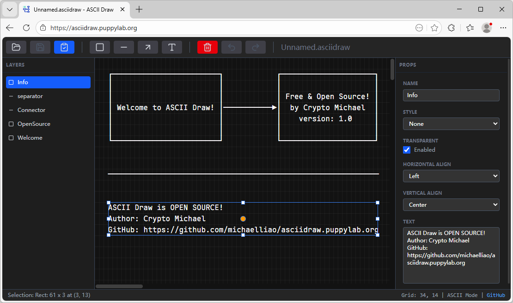

# ASCII Draw

[https://asciidraw.puppylab.org](https://asciidraw.puppylab.org)

ASCII Draw is a browser-based application for creating and editing ASCII art diagrams. It provides a visual editor for drawing boxes, lines, and text using Unicode box-drawing characters. The application operates entirely client-side with no backend server required, storing drawings in a custom JSON format.

